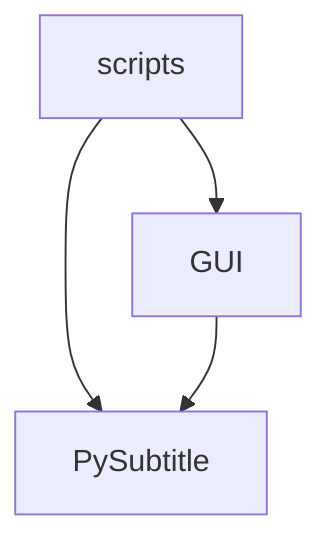

# LLM-Subtrans Architecture

This document provides a high-level overview of the `llm-subtrans` project architecture. It is intended to help new developers understand how the different parts of the application fit together.



## 1. Entry Points

| Script | Purpose | Location |
|--------|---------|----------|
| `gui-subtrans.py` | Launches the graphical interface, loads persistent settings, and initializes translation providers. | `scripts/gui-subtrans.py` |
| `llm-subtrans.py` | Command-line translator: loads a subtitle file, performs translation using specified provider/model, and saves results. | `scripts/llm-subtrans.py` |

## 1. Module Structure

**Module Overview**

*   **`PySubtitle`**: Core subtitle processing, translation, and project management.
*   **`GUI`**: PySide6-based user interface built on top of the `PySubtitle` engine.
*   **`scripts`**: Entry-point scripts for launching the GUI or command-line tools.

### PySubtitle (Core Logic)
* Houses all subtitle-processing, translation, and project-management code.
* Key subpackages/classes include:
  * `SubtitleProject` – orchestrates loading, saving, and translating a project.
  * `SubtitleLine` – in-memory representation of an individual subtitle line with timing and translation fields.
  * `SubtitleScene`, `SubtitleBatch`, `Subtitles` – break subtitle files into nested scenes and batches for translation.
  * `SubtitleTranslator` – drives the translation pipeline.
  * `TranslationProvider` – base class for pluggable translation backends.
  * `Options` – global settings manager loaded from environment variables, config files, and command line arguments.

### GUI (User Interface)
* Contains PySide6-based GUI code.
* Organised around a custom MVVM pattern:
  * `ProjectViewModel` – a `QStandardItemModel` subclass mapping `SubtitleProject` data to GUI views.
    * `SceneItem`, `BatchItem`, `LineItem` subclasses represent subtitle scenes, batches, and lines.
  * `ProjectDataModel` – “glue” layer keeping `SubtitleProject`, `Options`, `TranslationProvider`, and `ProjectViewModel` in sync.
* Custom widgets and views are located under `GUI/Widgets`, `GUI/ScenesBatchesModel`, `GUI/SubtitleListModel`, etc.

## Subtitle Management

The core of the subtitle management is the `PySubtitle.SubtitleProject` class. This class represents a single translation project and is responsible for:

*   Loading subtitles from a source file.
*   Saving and loading the project state to a `.subtrans` file, which is a JSON file containing all the subtitles, translations, and other information.
*   Orchestrating the translation process.

### Data Flow

1. **SubtitleProject**
   * Central manager for a translation session.
   * Reads/writes `.subtrans` project files.
   * Loads SRT files via `SubtitleFileHandler`, produces `Subtitles` object.
   * Handles saving originals and translated subtitles, plus project metadata.

3. **Subtitles / SubtitleScene / SubtitleBatch**
   * `Subtitles` holds global collections and metadata (target language, scenes, etc.).
   * `SubtitleScene` groups adjacent lines; `SubtitleBatch` groups lines within scenes for translation.
   * `SubtitleBatcher` and `SubtitleProcessor` handle scene/batch creation and optional post-processing.

3. **SubtitleLine**
   * Represents one subtitle entry (`index`, `start`, `end`, `text`, `translation`, metadata).
   * Provides parsing from SRT text and serialization back to SRT.
   * Exposes convenient computed properties (`duration`, `txt_start`, `translated`, etc.).

### File Formats

Currently, the application only supports the `.srt` subtitle file format. However, the architecture is designed to be extensible, and support for other formats is planned for the future.

## Translation Process

The translation process is managed by the `PySubtitle.SubtitleTranslator` class. This class is responsible for:

*   Taking a `Subtitles` object and splitting it into scenes and batches.
*   Sending the batches to a `TranslationProvider` for translation.
*   Handling retries, error management, and post-processing of the translations.

The `SubtitleTranslator` delegates the actual translation to a `PySubtitle.TranslationProvider` instance. The `TranslationProvider` is a plug-and-play component that allows the application to support different translation services. New providers can be added by creating a new module in the `PySubtitle.Providers` directory and implementing the `TranslationProvider` interface.

1. **SubtitleTranslator**
   * Accepts `Subtitles` and a `TranslationProvider`.
   * Iterates over scenes and batches, building prompts and context.
   * Calls provider’s client (`TranslationClient`) for each batch.
   * Applies `Substitutions`, optional `SubtitleProcessor`, and merges translations back into `SubtitleScene` data.
   * Emits events via `TranslationEvents` for GUI progress updates or logging.

2. **TranslationProvider & Clients**
   * `TranslationProvider` is a pluggable base class.
   * Providers located in `PySubtitle/Providers/` register themselves automatically.
   * Each provider exposes available models, validation, and a `GetTranslationClient` method to construct a client capable of calling external APIs.
   * This design allows adding new providers (e.g., different model servers) without altering core logic.
   
## GUI Architecture

1. **ProjectDataModel**
   * Holds the active `SubtitleProject`, `Options`, current `TranslationProvider`, and the shared `ProjectViewModel`.
   * Exposes helper methods for updating settings, creating translation providers, and manipulating the view model.

2. **ProjectViewModel (MVVM)**
   * Extends `QStandardItemModel` and maintains a tree:  
     `SceneItem` → `BatchItem` → `LineItem`.
   * Updates are queued via `AddUpdate()` and processed on the main thread (`ProcessUpdates`).

3. **Views**
   * `ScenesBatchesModel` & `SubtitleListModel` present scenes/batches and line details.
   * Delegates like `ScenesBatchesDelegate` and `SubtitleItemDelegate` handle custom painting/editing.

The GUI is built using PySide6 and follows a Model-View-ViewModel (MVVM) like pattern.

*   **`GUI.ProjectDataModel`**: This class acts as a bridge between the core `SubtitleProject` and the `ProjectViewModel`. It holds the current project, the project options, and the current translation provider. It's responsible for creating the `ProjectViewModel` and for applying updates to it.

*   **`GUI.ViewModel.ProjectViewModel`**: This is a custom `QStandardItemModel` that serves as the data model for the various views in the GUI. It holds a tree of `SceneItem`, `BatchItem`, and `LineItem` objects, which mirror the structure of the `Subtitles` data. It has an update queue to handle asynchronous updates from the translation process, ensuring that the GUI is updated in a thread-safe manner.

*   **Views**: The GUI is composed of several views, such as the `ScenesView`, `SubtitleView`, and `LogWindow`, which are all subclasses of `QWidget`. These views are responsible for displaying the data from the `ProjectViewModel` and for handling user input.

### Command Queue

* GUI actions follow a **Command** pattern.
* `CommandQueue` executes commands on a background `QThreadPool` with undo/redo support.
* Commands live under `GUI/Commands/`; each command encapsulates an operation (e.g., translating a batch, saving files).
* `CommandQueue` manages concurrency, progress signals, and queue state (`undo_stack`, `redo_stack`).

All operations that modify the project data are encapsulated in `Command` objects and executed by a `GUI.CommandQueue`. The `CommandQueue` runs commands on a background thread, which is essential for keeping the GUI responsive during long-running operations like file I/O or translation. It also manages undo/redo stacks, allowing the user to easily revert and re-apply actions.

## Settings Management

Application settings are managed by the `PySubtitle.Options` class. This class is responsible for:

*   Loading settings from a `settings.json` file.
*   Loading settings from environment variables.
*   Providing default values for all settings.
*   Managing provider-specific settings.

The `Options` class is used throughout the application to configure the behavior of different components.

 The `Options` class (subclass of `SettingsType`):
  * Loads defaults (environment variables via `.env`, `settings.json`, command-line arguments).
  * Supports project-specific settings and provider-specific settings via `ProviderSettingsView`.
  * Offers typed getters (`get_str`, `get_int`, `get_bool`) and convenience properties (`provider`, `target_language`, etc.).
  * Functions as the configuration backbone shared by core logic, translation providers, CLI scripts, and GUI components.

* Settings flow:
  1. CLI / GUI scripts build an `Options` instance.
  2. `SubtitleProject` reads translation/project parameters from it.
  3. `ProjectDataModel` copies and extends settings, keeping `SubtitleProject` and `TranslationProvider` synchronized.
  4. GUI forms (`ProviderSettingsView`, dialogs) modify `Options` or provider-specific settings, triggering updates across components.

## GUI View and Widget Architecture

The GUI's view and widget architecture is designed to be modular and extensible. It is built upon the `ProjectViewModel`, which provides the data for the various views.

### The `ModelView`

The central widget for displaying project data is the `GUI.Widgets.ModelView`. It is a container widget that uses a `QSplitter` to arrange three main components:

*   **`GUI.Widgets.ProjectSettings`**: A form for editing project-specific settings. It is displayed when the user clicks on the "Settings" button in the `ProjectToolbar`.
*   **`GUI.Widgets.ScenesView`**: A `QTreeView` that displays the scenes and batches from the `ProjectViewModel`.
*   **`GUI.Widgets.ContentView`**: A container widget that holds the `SubtitleView` and the `SelectionView`.

### Core Views

*   **`GUI.Widgets.ScenesView`**: This `QTreeView` provides a hierarchical view of the scenes and batches in the project. It uses a custom `GUI.ScenesBatchesModel` and `GUI.ScenesBatchesDelegate` to render the items. It allows for selection of scenes and batches, and for editing them by double-clicking.

*   **`GUI.Widgets.ContentView`**: This widget is the main area for interacting with the subtitles. It contains:
    *   **`GUI.Widgets.SubtitleView`**: A `QListView` that displays the subtitle lines for the selected scenes or batches. It uses a custom `GUI.SubtitleListModel` and `GUI.SubtitleItemDelegate` to render the lines. It supports selection and editing of individual lines.
    *   **`GUI.Widgets.SelectionView`**: A `QFrame` that displays information about the current selection (scenes, batches, or lines) and provides contextual actions. The buttons in this view are dynamically shown or hidden based on the current selection.

### Editors and Dialogs

*   **`GUI.Widgets.Editors`**: This module contains various dialogs for editing scenes, batches, and individual subtitle lines. These dialogs are launched when a user double-clicks on an item in the `ScenesView` or `SubtitleView`. They are built dynamically based on the data in the selected item.

### Reusable Widgets

*   **`GUI.Widgets.OptionsWidgets`**: This module provides a set of reusable widgets for editing different types of options (e.g., `TextOptionWidget`, `CheckboxOptionWidget`, `DropdownOptionWidget`). These are used to construct the forms in `ProjectSettings` and the main `SettingsDialog`.

*   **`GUI.Widgets.Widgets`**: This module contains a collection of custom widgets used to build the user interface, such as `TreeViewItemWidget` for rendering items in the `ScenesView`, and `LineItemView` for rendering items in the `SubtitleView`. These widgets help to create a consistent and visually appealing user interface.

### The `SettingsDialog`

The `GUI.SettingsDialog` is a powerful example of a data-driven user interface in the application. It is responsible for allowing users to edit the application's settings. The dialog is built dynamically based on a dictionary-based configuration, which makes it easy to add new settings and options without having to write a lot of boilerplate UI code.

#### Data-Driven UI Generation

The structure of the `SettingsDialog` is defined by the `SECTIONS` dictionary. This dictionary maps tab names (e.g., "General", "Processing") to a nested dictionary of setting keys and their types. For example:

```python
'General': {
    'ui_language': (str, _("The language of the application interface")),
    'theme': [],
    'target_language': (str, _("The default language to translate the subtitles to")),
    # ...
},
```

The dialog iterates over this dictionary and uses the `GUI.Widgets.OptionsWidgets.CreateOptionWidget` factory function to create the appropriate widget for each setting based on its type (`str`, `int`, `float`, `bool`, or a list for a dropdown). This approach makes the dialog highly extensible and easy to maintain.

#### Dynamic Provider Settings

A key feature of the `SettingsDialog` is its ability to display settings for the currently selected `TranslationProvider`. The "Provider Settings" tab is populated dynamically by calling the `GetOptions` method on the active `TranslationProvider` instance. This method returns a dictionary of settings that are specific to that provider.

This allows each translation provider to define its own set of options, which are then automatically displayed in the settings dialog when that provider is selected. This is a great example of the "plug-and-play" architecture of the translation providers.

#### Conditional Visibility

The `SettingsDialog` also uses a data-driven approach to manage the visibility of certain settings. The `VISIBILITY_DEPENDENCIES` dictionary defines the conditions under which a setting should be visible. For example, the `max_single_line_length` option is only visible if `postprocess_translation` and `break_long_lines` are both enabled. This is achieved by checking the values of the settings and showing or hiding the corresponding widgets accordingly. This makes the UI cleaner and more intuitive for the user.

### Command Queue and Execution

The application uses a command queue to manage all operations that modify the project data. This ensures that long-running operations are executed on a background thread, keeping the GUI responsive. The command queue system is also responsible for managing the undo/redo functionality.

#### The `GuiInterface`

The `GUI.GuiInterface` class is the central hub for the command queue system. It is responsible for:

*   **Creating and managing the `CommandQueue`**: The `GuiInterface` creates a single instance of the `CommandQueue` and connects to its signals (`commandStarted`, `commandExecuted`, `commandAdded`, `commandUndone`). This allows the `GuiInterface` to monitor the state of the command queue and to react to command events.

*   **Providing access to the `CommandQueue`**: The `GuiInterface` provides a `QueueCommand` method that allows other parts of the GUI to add commands to the queue. This is the primary way that the GUI interacts with the command queue.

*   **Wiring up signals and callbacks**: The `GuiInterface` connects signals from the `ProjectActions` handler to the appropriate slots for creating and queueing commands.

#### The `CommandQueue`

The `GUI.CommandQueue` is the heart of the command execution system. It is responsible for:

*   **Managing a queue of commands**: The `CommandQueue` maintains a queue of `Command` objects and executes them sequentially on a background thread pool (`QThreadPool`).

*   **Handling command execution**: The `CommandQueue` ensures that only one command is executed at a time (or more, if multithreading is enabled for specific commands). It also handles blocking commands, which prevent other commands from running in parallel.

*   **Managing undo and redo stacks**: The `CommandQueue` maintains two stacks of commands: an undo stack and a redo stack. When a command is executed, it is pushed onto the undo stack. If the user chooses to undo the command, it is moved from the undo stack to the redo stack.

#### The `Command` Class

The `GUI.Command.Command` class is the base class for all commands in the application. Each command encapsulates a single unit of work, such as loading a file, translating a batch of subtitles, or merging lines.

Key features of the `Command` class include:

*   **`execute()` method**: Each command must implement an `execute` method, which contains the logic for the command. This method is called by the `CommandQueue` when the command is executed.

*   **`undo()` method**: Commands can also implement an `undo` method, which contains the logic for reversing the command's effects. This method is called by the `CommandQueue` when the user chooses to undo the command.

*   **Model Updates**: Commands can generate `ModelUpdate` objects, which are used to update the `ProjectViewModel` in a thread-safe manner. This ensures that the GUI is always in sync with the project data.

*   **Callbacks**: Commands can have callbacks that are executed when the command is completed or undone. This allows for a flexible and decoupled way of handling the results of a command.

### Real-time UI Updates with `ViewModelUpdate`

To keep the user interface responsive and provide real-time feedback during long-running operations like translation, the application uses a system of `ViewModelUpdate` objects. These objects encapsulate a set of changes to be applied to the `ProjectViewModel`, and they are processed by the `GuiInterface` in a thread-safe manner.

#### The `ViewModelUpdate` Class

The `GUI.ViewModel.ViewModelUpdate` class is a container for a set of changes to be applied to the `ProjectViewModel`. It has separate sections for scenes, batches, and lines, and each section can contain additions, updates, and removals.

This allows a command to batch together a set of UI changes and send them to the `GuiInterface` for processing.

#### Updating the UI from a Running Command

The `GUI.Commands.TranslateSceneCommand` provides a great example of how a long-running command can update the UI while it is still executing.

When a `TranslateSceneCommand` is executed, it creates a `SubtitleTranslator` and subscribes to its `batch_translated` event. This event is fired every time a batch of subtitles has been translated.

The `_on_batch_translated` callback method in `TranslateSceneCommand` is responsible for creating a `ModelUpdate` object and populating it with the translated data for the batch. It then calls `self.datamodel.UpdateViewModel(update)` to send the update to the `GuiInterface`.

This allows the UI to be updated in real-time as each batch is translated, providing the user with immediate feedback on the translation progress.

#### Processing UI Updates in the `GuiInterface`

The `GUI.GuiInterface` is responsible for processing the `ViewModelUpdate` objects generated by the commands.

When a command is added to the `CommandQueue`, it is associated with the current `ProjectDataModel`. The `ProjectDataModel` has a `UpdateViewModel` method that adds the `ModelUpdate` to a queue in the `ProjectViewModel` and emits a `updatesPending` signal.

The `ProjectViewModel` has a `ProcessUpdates` method that is connected to the `updatesPending` signal. This method is executed on the main GUI thread and is responsible for applying the updates to the view model in a thread-safe manner.

Furthermore, when a command completes, the `_on_command_complete` callback in `GuiInterface` is executed. This callback iterates over any remaining `model_updates` in the command and applies them to the `ProjectViewModel`. This ensures that any final UI updates are applied after the command has finished executing.

This system of `ViewModelUpdate` objects and the `CommandQueue` allows for a clean separation of concerns between the business logic in the commands and the UI update logic in the `GuiInterface` and `ProjectViewModel`. It also ensures that all UI updates are performed on the main GUI thread, which is a requirement for Qt applications.

### The `TranslationProvider` and `TranslationClient`

The application's support for multiple translation services is built around a flexible and extensible provider system. This system is composed of two main components: the `TranslationProvider` and the `TranslationClient`.

#### The `TranslationProvider`

The `PySubtitle.TranslationProvider` class is the main entry point for a translation service. It is responsible for:

*   **Providing a `TranslationClient`**: Each `TranslationProvider` must implement a `GetTranslationClient` method that returns an instance of a `TranslationClient` subclass. This client is responsible for handling the actual communication with the translation service's API.

*   **Listing available models**: The `TranslationProvider` must also provide a list of available models for the translation service. This list is used to populate the "Model" dropdown in the `ProjectSettings` and `SettingsDialog`.

*   **Defining provider-specific options**: Each `TranslationProvider` can define a set of provider-specific options that are displayed in the `SettingsDialog`. This allows each provider to have its own set of configurable settings, such as API keys, endpoints, and other parameters.

#### Dynamic Provider Discovery

The application uses a dynamic import mechanism to discover and register all available translation providers at runtime. The `get_providers` class method in `TranslationProvider` calls the `import_providers` method, which iterates over all the modules in the `PySubtitle.Providers` package and imports them.

This means that to add a new translation provider, a developer simply needs to create a new module in the `PySubtitle.Providers` directory that contains a subclass of `TranslationProvider`. The application will automatically discover and register the new provider, making it available to the user. This is a powerful mechanism that makes the application highly extensible.

#### The `TranslationClient`

The `PySubtitle.TranslationClient` class is an abstract base class that defines the interface for communicating with a translation service. It has methods for:

*   **Building the translation prompt**: The `BuildTranslationPrompt` method is responsible for creating the prompt that is sent to the translation service.

*   **Requesting the translation**: The `RequestTranslation` method sends the prompt to the translation service and returns a `Translation` object.

*   **Parsing the response**: The `GetParser` method returns a `TranslationParser` that can parse the response from the translation service and extract the translated text.

Each translation provider must implement a subclass of `TranslationClient` that handles the specifics of its API, such as the request format, authentication, and error handling. This separation of concerns between the `TranslationProvider` and the `TranslationClient` makes the code more modular and easier to maintain.

### Translation Prompt and Parsing

The interaction with the Large Language Models (LLMs) for translation is managed by two key components: `TranslationPrompt` for preparing the input and `TranslationParser` for interpreting the output.

#### The `TranslationPrompt`

The `PySubtitle.TranslationPrompt` class is responsible for dynamically constructing the input prompt that is sent to the translation service. Its primary role is to format the various pieces of information required for translation into a coherent and effective message for the LLM. This includes:

*   **User-defined instructions**: Specific instructions provided by the user for the translation task.
*   **Subtitle lines**: The actual subtitle lines to be translated.
*   **Contextual information**: Summaries of previous scenes or batches, character names, and other relevant details that help the LLM understand the broader narrative.
*   **Prompt templates**: Configurable templates that define the overall structure and formatting of the prompt, allowing for adaptation to different LLM requirements (e.g., conversational message formats for chat models vs. single-string completion prompts).

The `TranslationPrompt` can also generate specialized "retry prompts" when a translation fails validation. These prompts include information about the errors encountered, guiding the LLM to correct its previous output.

#### The `TranslationParser`

Once a response is received from the translation service, the `PySubtitle.TranslationParser` class takes over to interpret and extract the translated content. Its main functions include:

*   **Extracting translations**: It uses a set of predefined and fallback regular expressions to identify and extract the translated subtitle lines from the raw text response provided by the LLM. This robust parsing mechanism helps to account for variations in the LLM's output format.
*   **Matching translations**: It attempts to match the extracted translated lines back to their original source subtitle lines, ensuring that the correct translation is associated with each original line.
*   **Validation**: After extraction, the `TranslationParser` performs validation checks on the translated content to assess its quality and adherence to specified rules (e.g., line length, number of newlines). Any errors found during validation can trigger re-translation attempts.

Together, `TranslationPrompt` and `TranslationParser` form a crucial bridge between the application's internal subtitle representation and the external LLM services, ensuring that inputs are well-formed and outputs are correctly interpreted and integrated back into the project.
