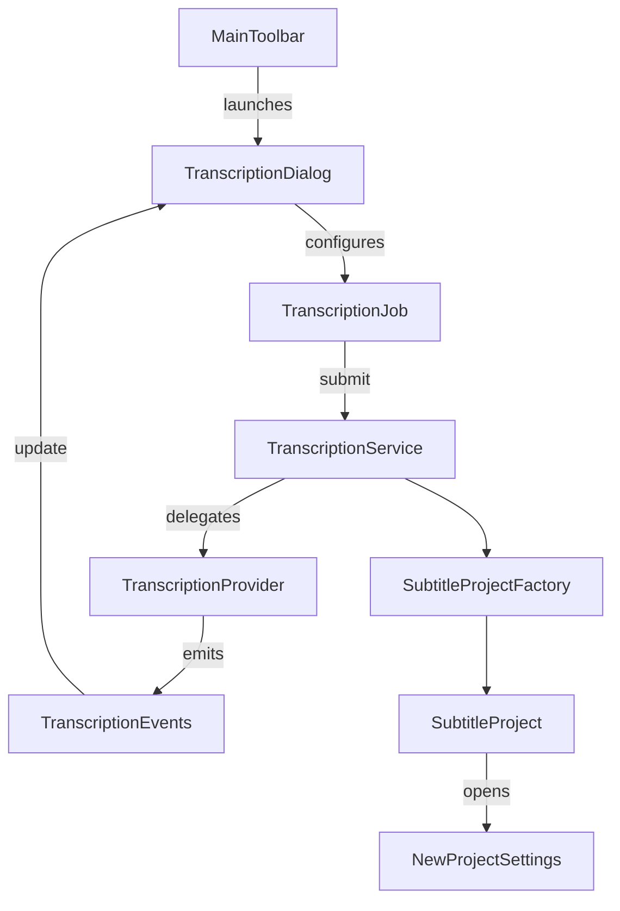

# Audio-Transcription Support Implementation Proposal

## The motivation
Currently LLM-Subtrans provides best-in-class translation of subtitles from one language to another, but it requires text subtitles in the source language to operate.

It is possible to produce source subtitles externally using applications like Whisper and then translate those, but this requires the use of another tool and can low quality transcriptions lead to bad translations.

We would like to add native support for transcribing audio, especially audio extracted from a video file.

## Requirements

Transcription should be a separate option accessible from the MainToolbar, which opens a UI interface dedicated to transcription.

The user should be able to select an audio or video file and a transcription service, initiate the transcription and view summary details of the process as it proceeds.

The result should be a SubtitleProject initialised with the transcription and configured with the NewProjectSettings dialog, from which the user can proceed on to translation.

If a video file contains multiple audio streams the user should be presented with a drop-down to select the stream for transcription.

We should avoid dependencies on external tools like ffmpeg if possible, the app should be a self contained transcription-translation ecosystem.

## Initial phase
The initial phase is one of discovery and proof of concept:
- Research options for extracting audio streams from video files
    - Minimum requirement is MKV file support
    - MP4 file format would be a very welcome bonus
- Research options for transcription services.
    - Qwen Audio (https://qwen.ai/blog?id=41e4c0f6175f9b004a03a07e42343eaaf48329e7&from=research.latest-advancements-list, https://huggingface.co/Qwen/Qwen-Audio) seems promising
    - Gemini Audio Understanding could be a good alternative (https://ai.google.dev/gemini-api/docs/audio)
    - OpenRouter provides a number of audio to text capable models via their API (https://openrouter.ai/models?fmt=cards&input_modalities=audio&output_modalities=text)
- We should support API-based transcription, as this is inherently cross-platform and should work for users who cannot host a viable model locally
    - We should consider supporting local transcription as well, for users who have the hardware, but this is a secondary use case
- Research transcription formats offered by these services, and consider whether we need to implement a custom SubtitleFileHandler to support them
    - It seems probably that the VTT support we already have is enough
- Consider whether we should extend the internal Subtitle class and SubtitleTranslator, SubtitlePrompt etc. to include metadata such as speaker ids, to help the translation service
- Determine what new classes and modules we need to add to the project.
    - Transcription should be provided as a service by the PySubtitle module
    - The interface to control transcription should be part of the GUI module.
    - CLI support can be considered later, maybe a simple --transcribe option that changes the flow of llm-subtrans.py

## Additional research & considerations

### Media extraction landscape
- **PyAV** wraps FFmpeg libraries and can enumerate audio streams without spawning external binaries. It satisfies the multi-stream MKV/MP4 requirement but increases our wheel footprint and still depends on FFmpeg shared libraries bundled per-platform.
- **GStreamer (gst-python)** offers native bindings and Windows/macOS installers, yet adds significant installation complexity. Its plugin model may be more overhead than we need for simple demuxing.
- **pydub/soundfile/librosa** offer convenient audio manipulation but rely on FFmpeg or libsndfile. They cannot inspect container-level metadata by themselves and therefore are better suited as downstream processors once we already have an extracted track.
- **MediaInfo** (pymediainfo) can detect available streams without demuxing. Combining MediaInfo for inspection and a lightweight extractor (PyAV or ffmpeg binding) might keep dependencies modular.
- If we decide to avoid FFmpeg completely, we could shell out to platform codecs via `wave`/`aifc` after using OS-specific APIs (MediaFoundation, AVFoundation) but that would require per-platform implementations and is out of scope for the first pass.

### Transcription service landscape
- API providers beyond the initial candidates include AssemblyAI, Deepgram, Azure Speech-to-Text and OpenAI Whisper API. They expose JSON/VTT/SRT outputs and support streaming uploads; their quotas, privacy guarantees and pricing differ substantially.
- Local-first models (Faster-Whisper, WhisperX, Parakeet, Distil-Whisper) can run on CPU/GPU with quantization. They require handling chunking, batching and optional voice activity detection (VAD) locally.
- Most services accept 16 kHz mono PCM WAV or MP3/OGG containers. Our extractor therefore needs to resample and transcode consistently regardless of the source stream format.
- Speaker diarization metadata is often optional and has inconsistent schemas. We should design internal data structures that can capture speaker labels, confidence scores and per-word timings even if we initially only store segment-level text.

### Data handling, UX and quality concerns
- Uploading long-form video audio may exceed provider size/time limits. Chunked uploads with resumable progress and user feedback are required.
- Latency and cost awareness should be surfaced—estimate billable duration before dispatching requests and warn the user.
- Users may want to clean audio (normalisation, denoising) prior to transcription. While advanced DSP is future work, exposing a hook for pre-processing keeps the architecture extensible.
- Multi-lingual content and code-switching can confuse transcription models; we should capture detected language metadata and propagate it to translation defaults.
- Accessibility: we should allow transcription-only workflows that produce SRT/VTT without forcing translation.

### Risks and open questions
- **Dependency size/licensing:** Bundling FFmpeg-derived binaries has LGPL/GPL implications. We must confirm acceptable licenses and ship source acknowledgements.
- **Asynchronous workflow:** Transcription jobs may outlast the UI session; we need resumable task management and guard against app shutdown mid-job.
- **Security:** API keys for audio providers must be stored like existing translation provider credentials (Options + secure storage). Uploaded audio may contain sensitive content; we must document privacy considerations.
- **Testing complexity:** Automated tests will require deterministic fixtures (short audio clips) and mocking of provider APIs to avoid network reliance.
- **Localization:** UI strings, error messages and provider-specific configuration must remain translatable.

## Proposed staged implementation plan

### Stage 0 – Research consolidation
**Objectives:** Validate feasibility, select initial dependencies, refine scope.

**Key actions**
- Finalise media inspection/extraction tooling choice (PyAV vs. ffmpeg binary vs. hybrid approach) with proof-of-concept scripts.
- Evaluate API requirements for the short-listed transcription providers (authentication, upload limits, output formats).
- Draft data contracts for transcription responses (segments, timestamps, speakers, confidence) and align with existing subtitle schema.
- Produce UX wireframes for the transcription dialog and confirm navigation flows with stakeholders.

**Acceptance tests**
- [ ] Documentation updated with dependency decision rationale and SDK/API references.
- [ ] Prototype can enumerate audio streams from both MKV and MP4 sample files.
- [ ] Prototype can upload a short WAV file to at least one provider sandbox and receive text back.

### Stage 1 – Media ingestion pipeline
**Objectives:** Implement reusable, cross-platform audio inspection and extraction utilities in PySubtitle.

**Key actions**
- Add a `MediaInspector` helper capable of listing audio streams (language, codec, channel count, default flag) using the chosen backend.
- Implement an `AudioExtractor` that outputs 16 kHz mono PCM WAV via in-process demux/resample to avoid shelling out when possible; allow graceful fallback to bundled ffmpeg binary if native extraction fails.
- Integrate progress callbacks and cancellation tokens compatible with the existing `CommandQueue` model.
- Provide unit tests using fixture MKV/MP4 files with single and multiple audio streams.

**Acceptance tests**
- [ ] Inspector returns accurate stream metadata for provided MKV and MP4 fixtures.
- [ ] Extractor produces WAV files whose duration matches the source audio within ±50 ms.
- [ ] Extraction aborts cleanly when cancellation is requested mid-process.

### Stage 2 – Transcription services foundation
**Objectives:** Establish abstraction layer for cloud/local transcription providers.

**Key actions**
- Introduce `TranscriptionProvider` base class with discovery/registration mirroring translation providers (metadata, configuration schema, capability flags).
- Define request/response models (`TranscriptionJobConfig`, `TranscriptionSegment`, etc.) that normalise provider outputs.
- Implement HTTP client utilities for multipart uploads, streaming responses and exponential backoff retries.
- Build the first API provider integration (e.g., Qwen Audio) including options UI schema, authentication storage and response parsing to Subtitle-compatible structures.
- Add mocking utilities so unit tests can simulate provider responses without network calls.

**Acceptance tests**
- [ ] Provider discovery lists the new transcription provider with descriptive metadata.
- [ ] Unit tests validate request payload construction, response normalisation and error handling for success, rate-limit and invalid credential scenarios.
- [ ] End-to-end integration test converts a short fixture WAV into subtitle segments in memory.

### Stage 3 – GUI workflow integration
**Objectives:** Deliver a dedicated transcription UI and connect it to the PySubtitle services.

**Key actions**
- Add a `TranscriptionDialog` launched from the MainToolbar with file picker, stream selector, provider dropdown and settings panes.
- Present progress (percentage, elapsed time, estimated cost) and allow pause/cancel/resume controls backed by the command queue.
- Surface transcription summaries (language detection, duration, segment counts) and provide an option to create a `SubtitleProject` immediately or save raw transcript files.
- Ensure UI strings are localised and align with existing theming/layout conventions.

**Acceptance tests**
- [ ] Smoke test: selecting an MKV with two audio streams allows choosing a stream and starts transcription without crashes.
- [ ] Progress UI updates at least every 2 seconds and reflects cancellation requests.
- [ ] Creating a project from transcription opens the standard `NewProjectSettings` dialog pre-populated with detected language.

### Stage 4 – Workflow persistence and CLI support
**Objectives:** Integrate transcriptions into project lifecycle and expose non-GUI entry points.

**Key actions**
- Extend `SubtitleProject` to store transcription metadata (provider, model, diarization) alongside translation data.
- Support saving/loading `.subtrans` projects that originated from transcription, ensuring compatibility with translation-only flows.
- Add optional CLI `--transcribe` mode with stream selection, provider choice and output to SRT/VTT or `.subtrans`.
- Implement caching of transcription results to avoid re-uploading identical files when the user restarts the app.

**Acceptance tests**
- [ ] Projects created from transcription persist and re-open with transcription metadata intact.
- [ ] CLI transcription command processes provided media fixture and writes VTT output without manual interaction.
- [ ] Cached transcription is reused when re-running with the same source file and provider.

### Stage 5 – Quality, performance and extensibility
**Objectives:** Harden the feature for general release and prepare for future enhancements.

**Key actions**
- Add optional diarization view in the UI, mapping speaker labels to subtitle lines when available.
- Benchmark transcription throughput and memory usage for long-form audio; profile extraction for GPU/CPU variations.
- Evaluate second provider integration (e.g., Gemini Audio) to validate abstraction; add local/offline backend if feasible.
- Expand automated tests with synthetic noisy audio to ensure resilience of segmentation and timestamp rounding.
- Update documentation, tutorials and in-app help to describe the new workflow and troubleshooting steps.

**Acceptance tests**
- [ ] Automated regression suite covering extraction, provider abstraction and GUI flows passes on Windows, macOS and Linux CI targets.
- [ ] Two distinct transcription providers can be configured and used interchangeably in the UI.
- [ ] User documentation for transcription is published and reviewed.

## Technical direction notes
- Follow the existing provider registration pattern to minimise duplication and allow shared configuration UI components.
- Reuse the `CommandQueue`/`Command` infrastructure for long-running transcription tasks to inherit thread management and progress signalling.
- Standardise intermediate audio representation on 16-bit PCM WAV, 16 kHz, mono to match most APIs while keeping the converter extensible for provider-specific requirements.
- Adopt a message-based event stream (`TranscriptionEvents`) similar to translation to maintain consistency in logging and future CLI progress reporting.
- Implement robust temporary file management: extraction should write to `Options().get_cache_path()` and clean up on success/cancellation.
- Ensure provider modules declare capability flags (e.g., `supports_streaming`, `supports_diarization`, `max_upload_minutes`) so the UI can guide user expectations and prevent unsupported configurations.
- Plan for offline/local models by abstracting compute backends; e.g., allow providers to advertise whether they require GPU acceleration.
- Expand telemetry/logging to include anonymised metrics (duration, success/failure, provider) when the user opts in, aiding future optimisation.

## Proposed architecture & interfaces



### Interface sketch (subject to refinement)

```python
class TranscriptionJobConfig(NamedTuple):
    source_path : Path
    stream_index : int
    provider_id : str
    options : dict[str, Any]


class TranscriptionProvider(Protocol):
    id : str
    display_name : str
    capabilities : TranscriptionCapabilities

    def create_client(self, options : Options) -> "TranscriptionClient": ...


class TranscriptionClient(Protocol):
    def transcribe(self, audio_source : AudioSource, events : TranscriptionEventSink) -> TranscriptionResult: ...


class TranscriptionService:
    def start_job(self, config : TranscriptionJobConfig) -> CommandHandle:
        ...
```

- `AudioSource` abstracts over temporary files or in-memory buffers so that providers can stream data without touching disk.
- `TranscriptionResult` will encapsulate a list of `TranscriptionSegment` objects (start/end timestamps, text, speaker, confidence) plus metadata (detected_language, provider_info, duration_seconds).
- `SubtitleProjectFactory` converts `TranscriptionResult` into a `SubtitleProject`, populating scenes/batches by reusing existing segmentation utilities and injecting metadata for downstream translation hints.
- GUI components observe `TranscriptionEvents` to update progress bars, error messages and completion summaries, while CLI mode logs similar events to stdout.
- Providers register themselves through an entry-point like mechanism (mirroring `TranslationProviderRegistry`) so that third parties can contribute additional backends in the future.

